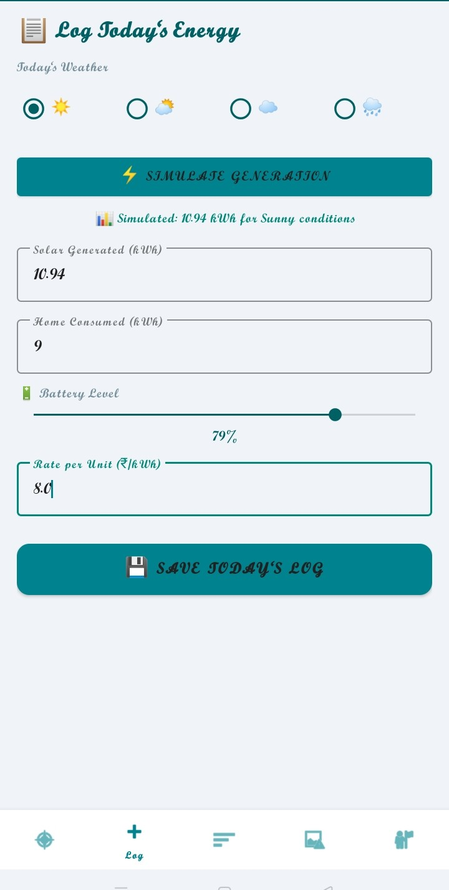

# ☀️ SuryaShakti Solar Monitor

An Android application for monitoring solar energy production and usage in real time using Firebase integration and live dashboard analytics.

---

## 📌 Overview

SuryaShakti is a smart Android application developed to help users monitor solar energy generation and consumption efficiently. The app provides real-time updates, energy statistics, and a simple dashboard for better energy management.

The project aims to promote renewable energy awareness and efficient power usage through a mobile-based monitoring system.

---

## ✨ Features

- 🔋 Real-time solar monitoring
- 📊 Energy usage tracking
- ☁️ Firebase Realtime Database integration
- 📈 Live data updates
- 📱 User-friendly dashboard
- ⚡ Fast and responsive UI
- 🔄 Real-time synchronization

---

## 🛠️ Technologies Used

### Frontend
- Kotlin
- XML UI Design

### Backend / Database
- Firebase Realtime Database

### Development Tools
- Android Studio
- Gradle

---

## 📂 Project Structure

```text
SuryaShakti/
│
├── app/                # Main Android application
├── screenshots/        # Application screenshots
├── apk/                # APK build file
├── report/             # Project report and documentation
├── README.md
└── build.gradle
```

---

## 🚀 Installation & Setup

### Step 1 — Clone Repository

```bash
git clone https://github.com/Sreerakshahs/SuryaShakthiApp.git
```

### Step 2 — Open in Android Studio

- Open Android Studio
- Click **Open Project**
- Select the cloned folder

### Step 3 — Sync Dependencies

- Allow Gradle to sync automatically

### Step 4 — Configure Firebase

Add your Firebase configuration file:

```text
google-services.json
```

Place it inside:

```text
app/
```

### Step 5 — Run Application

- Connect Android device or start emulator
- Click **Run ▶️**

---

## 📸 Screenshots
### Dashboard Screen


### Firebase Integration


### Log Entry Screen


---

## 📱 APK File

APK file is available inside:

```text
apk/
```

---

## 🔮 Future Enhancements

- 🤖 AI-based energy prediction
- 🔔 Notification alerts
- 📅 Monthly analytics reports
- 🌐 Cloud dashboard support
- 📊 Advanced visualization charts

---

## 🧪 Testing

Tested on:
- Android Emulator
- Android 11+
- Firebase Realtime Database

---

## 📄 Project Report

Documentation and reports are available in:

```text
report/
```

---

## 👨‍💻 Author

Developed by **Sree Raksha**

GitHub:
https://github.com/Sreerakshahs

---

## 📜 License

This project is licensed under the MIT License.
